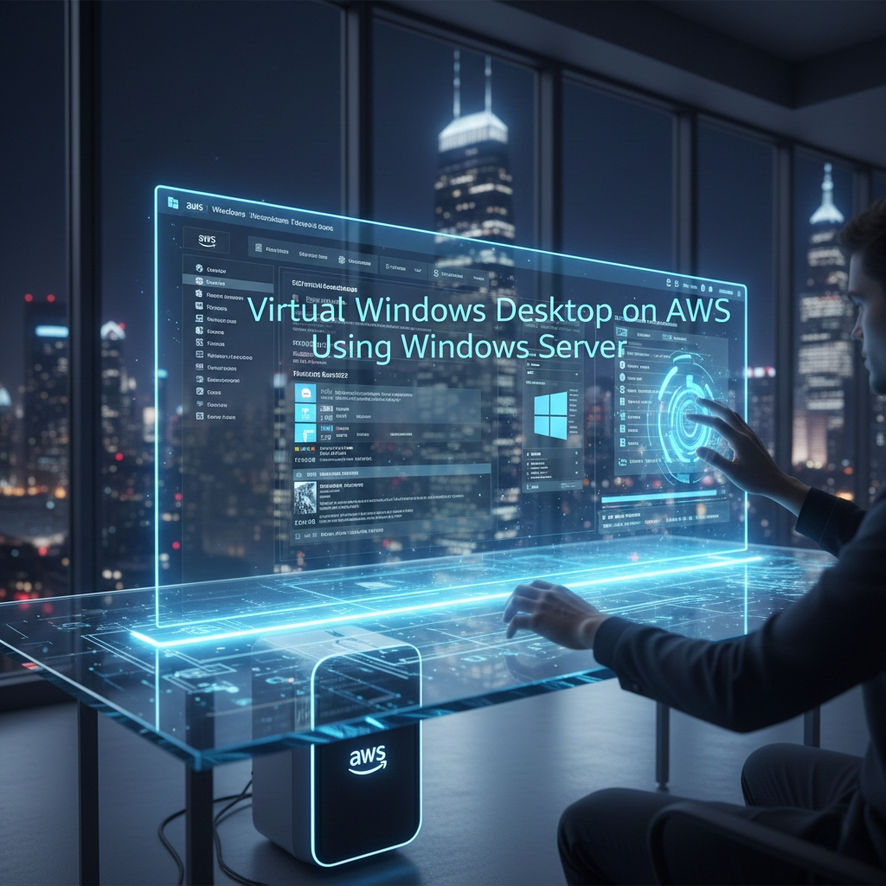

<div align="center">
  
  
  <h1 style="color: #ff8c42; font-weight: bold; letter-spacing: 2px;">VIRTUAL WINDOWS DESKTOP ON AWS</h1>
  
  <p><i>High-Performance Windows Environments, Anywhere in the World.</i></p>

  <p>
    <a href="https://github.com/chimataraghuram"></a>
    <a href="https://aws.amazon.com/"></a>
  </p>

  

  <br>

  <p align="center">
    <b>Experience the power of cloud computing with a dedicated Virtual Windows Desktop. This project provides a comprehensive guide and configuration for setting up a high-performance Windows Server on AWS, ensuring seamless remote access, top-tier security, and unmatched scalability for developers and students alike.</b>
  </p>
</div>

---


## 🖼️ Project Screenshots
*Visual evidence of the deployment and configuration process.*

### 1. Initial Connection & Setup
The initial connection to the virtual machine via RDP.


<br>

### 2. Virtual Desktop Environment
The fully functional Windows desktop environment, displaying real-time EC2 instance details.


<br>

### 3. Start Menu & Applications
Access to pre-installed tools and applications, including Server Manager and PowerShell.


<br>

### 4. System Specifications
Windows System settings confirming the hardware configuration provided by AWS.


<br>

### 5. Additional Configurations
Further system setup and exploration of the Windows Server environment.


<br>

### 6. Final Verification
Final checks ensuring the deployment is secure, stable, and ready for development.


---

## ✨ Features
Discover what makes this cloud deployment powerful and efficient.

| Icon | Feature | Description |
| :--- | :---: | :--- |
| 🚀 | **Rapid Deployment** | Launch a fully functional Windows Server in minutes. |
| 🔒 | **Secure Access** | VPC and Security Group isolation for maximum safety. |
| 📈 | **Elastic Scaling** | Upgrade instances instantly as your workload grows. |
| 🌍 | **Global Reach** | Deploy in any AWS region to minimize latency. |
| 💻 | **Multi-Device** | Access from Windows, Mac, Linux, or Mobile via RDP. |

---

## 🎯 Problem Statement
Many users need a reliable Windows desktop environment for development, testing, or remote access, but face limitations such as low-spec hardware, lack of portability, and risk of system damage when running unknown or unstable applications. Additionally, there is a need for a secure and isolated environment where applications can be tested without affecting the host system or compromising personal data.

---

## 🚀 Solution
To address this, a cloud-based virtual Windows desktop was implemented using Amazon EC2 with Windows Server, accessible via Remote Desktop Protocol (RDP). The system provides a fully isolated and scalable environment independent of the user’s local machine, enabling safe testing of applications within a sandbox. Security groups were configured to restrict access, ensuring controlled and secure connectivity. This solution allows users to work remotely, test software safely, and eliminate dependency on physical hardware.

---

## 🛠️ Tech Stack
The project is built using industry-standard cloud technologies:

- **Cloud Platform:** AWS (EC2, VPC, IAM, Elastic IP)
- **Operating System:** Windows Server 2022 / 2019
- **Remote Access:** Microsoft RDP (Remote Desktop Protocol)
- **Security:** AWS Security Groups & Key Pairs

---

## 📁 Project Structure
A clean and structured look at the repository contents.

```bash
Virtual-Windows-Desktop-on-AWS/
├── images/                    # Project deployment screenshots
├── README.md                  # Premium documentation (You are here)
└── Virtual_Windows_Desktop... # Detailed setup guide (PDF)
```

---

## 🚀 Future Roadmap
Continuously improving the cloud experience.

- [ ] **Lambda Automation:** Script to auto-shutdown instances during off-hours to save costs.
- [ ] **Multi-User Setup:** Configuring Active Directory for multiple concurrent users.
- [ ] **GPU Optimization:** Adding configurations for G-series instances for media editing.

---

## 🤝 Contributing
Contributions are what make the open-source community such an amazing place to learn, inspire, and create.

1. **Fork** the Project
2. Create your **Feature Branch** (`git checkout -b feature/AmazingFeature`)
3. **Commit** your Changes (`git commit -m 'Add some AmazingFeature'`)
4. **Push** to the Branch (`git push origin feature/AmazingFeature`)
5. Open a **Pull Request**

---

## 📜 License
This project is licensed under the MIT License.

**Important**
> You are free to use, modify, and contribute to this project. However, proper attribution must be given to the original author. This project is created for learning and development purposes—do not claim this work as your own.

---

## 👤 Author
**Raghu**  
*Cloud Enthusiast & Developer*

[](https://github.com/chimataraghuram)
[](https://www.linkedin.com/in/chimataraghuram/)

---

<p align="center">
  COOKED BY RAGHU❤️
</p>
